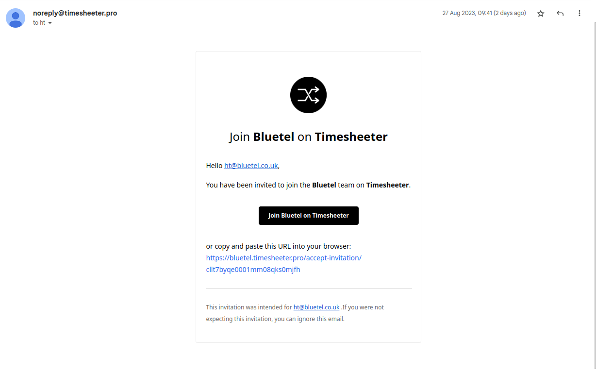
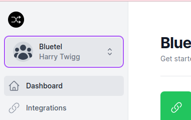

## Timesheeter

Timesheeter is a helper app that automates filling out your timesheets.

### Getting signed up to Timesheeter

Make sure you are using the Bluetel subdomain at `bluetel.timesheeter.pro`.

You will to ask for an invite to join the workspace that will look like this:

Click the link in the email and you will be taken to a page to sign up with your company gmail account.

You should then get redirected to the Bluetel workspace. If you don't you can switch to the Bluetel workspace by clicking the dropdown in the top left.

